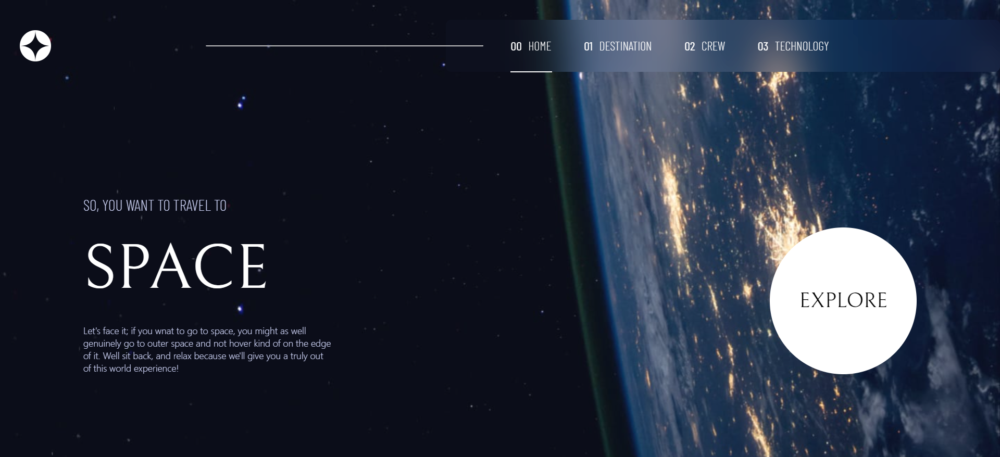

# Frontend Mentor - Space tourism website solution

This is a solution to the [Space tourism website challenge on Frontend Mentor](https://www.frontendmentor.io/challenges/space-tourism-multipage-website-gRWj1URZ3). Frontend Mentor challenges help you improve your coding skills by building realistic projects. 

## Table of contents

- [Overview](#overview)
  - [The challenge](#the-challenge)
  - [Screenshot](#screenshot)
  - [Links](#links)
- [My process](#my-process)
  - [Built with](#built-with)
  - [What I learned](#what-i-learned)
  - [Useful resources](#useful-resources)
- [Author](#author)
- [Acknowledgments](#acknowledgments)

## Overview

### The challenge

Users should be able to:

- View the optimal layout for each of the website's pages depending on their device's screen size
- See hover states for all interactive elements on the page
- View each page and be able to toggle between the tabs to see new information

### Screenshot

### Links

- Live Site URL: [View Site](https://th3bossc.github.io/SpaceTourism-FrontendMentor/)

## My process

### Built with

- Semantic HTML5 markup
- CSS custom properties
- Flexbox
- CSS Grid
- Mobile-first workflow
- [AngularJS](https://angular.io/) - JS library
- [Sass](https://sass-lang.com/) - CSS preprocessor

### What I learned

I learnt how to use Angular's signals and router more profusely than I had ever implemented in my past projects. Working on this also helped me get a hang of Sass and angular's workflow

### Useful resources

- [Angular Documentation](https://www.angular.io/docs) - Simple and accurate documentation from Angular community was very helpful when trying to figure out how to do many of the things i was trying for the first time.

## Author

- Website - [Diljith P D](https://th3bossc.github.io/Portfolio)
- Frontend Mentor - [@th3bossc](https://www.frontendmentor.io/profile/th3bossc)

## Acknowledgments

I thank my collegues for helping me in the challenges i faced, as well as the youtube channels, Kevin Powell and webdevsimplified for the robust frontend tips which came in handy while working on this website
